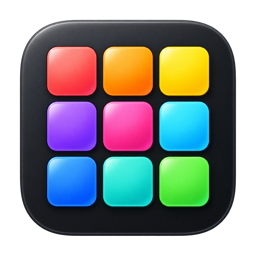
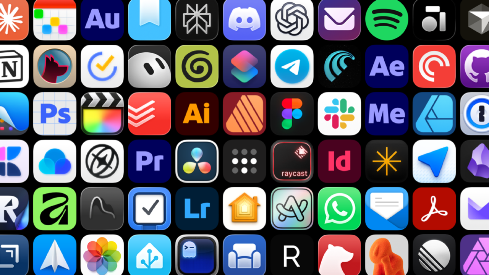

# App Mosaic Screensaver



A native macOS screensaver that fills the screen with installed app icons, staggered fades, and optional continuous scrolling. App Mosaic 1.0 uses cached Core Animation layers and a tighter grid inspired by Apple's keynote app walls.



## Use it

1. Download **App Mosaic.saver.zip** from the [latest release](https://github.com/cwkone/app-mosaic-screensaver/releases/latest), unzip it, and open **App Mosaic.saver**. To build from source, use `./Scripts/build.sh`, then run `./Scripts/install.sh`.
2. Select **App Mosaic** in **System Settings → Screen Saver** and open **Options**.
3. For a regular window, download **App Mosaic Preview.zip** from the same release and open the extracted app. Source builds also place it in **~/Library/Application Support/App Mosaic/Builds/**. Its options use the same preferences. Keep and open this companion app once if you want App Mosaic to appear in Focus filter settings.

The installer copies the bundle into your user Library and saves a backup of an existing installation. It does not select a screensaver or change wallpaper or lock settings.

Build output, ZIPs, local backups, and QA output are generated locally and are not committed to this repository.

## Artwork and current limitations

The preview app and screensaver file share the App Mosaic icon. Artwork and thumbnail assets live in `Resources/`; the original generated icon and its prompt are in `Resources/Artwork/`. The build and installer apply the screensaver's native Finder icon after signing and preserve that metadata in the ZIP.

## License

The source code, tests, and build scripts are available under the [MIT License](LICENSE). Artwork, screenshots, icons, thumbnails, generated images, video, logos, the App Mosaic name, and third-party trademarks or assets are not covered by that license and remain subject to their respective rights.

**System Settings thumbnail remains unresolved.** The bundle includes PNG and TIFF thumbnail assets, but System Settings still displayed the generic galaxy image in the latest observed installation. Other third-party savers on the same Mac display custom thumbnails. Installation, registration, and thumbnail caching need further investigation; the presence of the bundled assets does not establish that the library thumbnail works.

## Options

| Tab | Control | Range / default |
| --- | --- | --- |
| Layout | Icon size | 64–256 points; default 104 |
| Layout | Grid spacing | Gap from 0–60% of icon width; default 8% |
| Layout | Screen edges | Fill the screen (default), or Keep whole icons |
| Layout | Screen margin | 0–15% of the shorter screen dimension; default none |
| Animation | Change frequency | Approximately one change every 0.25–30 seconds; default 2.59 seconds |
| Animation | Fade duration | 0.2–10 seconds for each half of the fade; default 1.5 seconds out and 1.5 seconds in |
| Animation | Grid movement | Stationary (default), Left, Right, Up, Down |
| Animation | Scroll speed | 8–240 seconds per grid cell; default 52 seconds |
| Appearance | Fade at screen edges | Black fades extending 0–30% of the usable grid's shorter dimension inward on each side; default off |
| Appearance | Icon colors | Original (default), Monochrome, Tinted |
| Appearance | Tint color / strength | Native color picker and 0–100% strength; applies to Tinted mode |
| Presets | Preset | Create, rename, delete, and select complete App Mosaic configurations |
| Presets | App group | Reuse a named app selection across presets |
| Presets | Automatic tint | Off, fixed times, or local sunrise and sunset, with separate day and night colors |

The default grid continues beyond the display edges. Icon artwork is normalized by trimming empty canvas around its visible body while preserving its proportions and transparent shape. This makes the gap consistent across modern Mac icons and avoids large side gutters on 16:9 displays. Older icons with unusual shapes retain those shapes.

Keep whole icons fits the stationary grid or the non-scrolling axis. Scrolling icons always enter and leave through the screen edges. Screen margin is independent of icon spacing. Edge fading is an optional overlay; the default preserves the reference's sharp, full-color appearance.

**Choose Apps…** supports search, individual inclusion checkboxes, Include All, and Exclude All. Bulk actions apply to the entire collection, even while filtered. New apps are included automatically unless excluded. **Done** in the chooser returns to the options; **Done** in the main options saves everything. **Cancel** discards all pending edits. **Restore Defaults** resets every visual control and clears exclusions; press Done to commit.

## Presets, app groups, and Focus

A preset saves the complete layout, animation, appearance, automatic tint, and app-group choice. The selected preset is the normal configuration. App groups keep app selections independent from visual settings: the initial **All Apps** group includes newly installed apps automatically, while a group created from the current selection includes only those chosen apps.

The preview app contains an App Intents extension for macOS Focus filters. After opening the companion app once, go to **System Settings → Focus**, choose a Focus, add an **App Mosaic** filter, and select a preset. That preset temporarily overrides the normally selected preset while the Focus is active. Turning the Focus off restores the normal selection. Apple’s public Focus API lets each Focus filter carry a chosen preset; it does not give App Mosaic unrestricted access to the name of the active Focus.

Focus support belongs to the preview companion app because macOS runs Focus changes through an App Intents extension, including when the app is closed. Installing only the `.saver` does not install that extension. Preset data remains local in the same per-user preferences used by the screensaver.

## Automatic tint and location

Each preset can blend between separate day and night colors and strengths. **Time of day** uses chosen clock times. **Sunrise & sunset** calculates the solar times on the Mac from a saved latitude and longitude; the transition slider controls how gradually the colors blend around those events.

Enter coordinates directly, use **Find** for a place name, or open the options from App Mosaic Preview and choose **Use Current**. Current-location values are rounded to three decimal places before saving, roughly city-level precision. Location permission is requested only for **Use Current**; manual place and coordinate entry remain available if permission is declined. The screensaver host does not request location permission. The saved name and coordinates stay in local preferences. Place-name lookup uses Apple’s geocoding service, and App Mosaic has no separate server or account.

Preferences from earlier development builds preserve icon size, movement, fade duration, exclusions, and the actual change/scroll timing even though the slider ranges are wider. The tighter spacing and edge layout apply as the new defaults. Original icon colors and no edge fade remain defaults.

## Local app discovery

Each Mac scans its own `~/Applications`, `/Applications`, `/System/Applications`, and `/System/Library/CoreServices/Applications`, plus Finder. Collection folders are searched up to six nested levels. Hidden folders, app internals, explicitly background-only apps, and dependency/source/resource folders are skipped. Menu bar apps are included. Duplicate bundle IDs appear once. Apps outside these folders are not discovered in this version.

Discovery skips SDK source trees and dependencies such as Unreal Engine source files and `node_modules`; an editor installed under `Engine/Binaries/Mac` remains discoverable. The last catalog is cached locally and displayed immediately on subsequent starts, with a background refresh when needed. Screens sharing a host share the scan and artwork cache. The first scan on a host can take several seconds with a large app collection. No app is launched and nothing is uploaded.

The shuffle bag avoids visible duplicates when enough apps exist. Apps still on screen at the end of a cycle are deferred; other apps may repeat until those become eligible. Small collections necessarily repeat icons. Excluding every app produces a black saver and a “No apps selected” message in the small preview.

## Rendering and performance

Position and opacity animate through Core Animation. There is no per-frame AppKit drawing loop, cache traversal, or icon loading. The screensaver's frame callback does no rendering, and the preview app no longer has its own 30 Hz frame timer. A sparse timer schedules icon replacements and completion cleanup.

Icons are decoded, normalized, and filtered on a bounded background work queue, then retained as immutable textures. Shared artwork caching is bounded to 64 MB; currently displayed textures remain owned by their layers. Approximately 12% of cells may transition concurrently. Tint and monochrome effects are applied once when preparing a texture, not once per frame. Edge fades use static gradient overlays on black.

Stopping or detaching a view cancels pending work and clears its layers. A stopped view stays inactive even if the host resizes it. Screen-sleep and screensaver lifecycle notifications suspend rendering, without terminating the system host.

The performance tests measure process CPU and renderer work, not WindowServer/GPU cost. Offscreen timings and tests with sleeping displays do not establish live display frame rate. Verify smoothness and power use in the real screensaver on the target Intel or Apple Silicon hardware.

## Build and verify

Development preview builds require Apple’s Command Line Tools with a macOS SDK and a Swift 6.2-compatible compiler. Universal distribution builds require a complete Xcode installation because Apple’s App Intents metadata processor packages the Focus filter extension. No external packages are used.

```sh
./Scripts/preview-dev.sh --verify  # Native development build and visual/control checks
./Scripts/build.sh               # Universal arm64 + x86_64 distribution build
./Scripts/test.sh                # Model, artwork, catalog, bundle and preview checks
./Scripts/install.sh
```

Signed bundles live in `~/Library/Application Support/App Mosaic/Builds/` to avoid Finder metadata signing failures in synced Documents folders. Portable ZIPs live in `dist/`. Builds target macOS 14.6+ and are locally ad-hoc signed, not Developer ID signed or notarized for public distribution. Apple Silicon is compiled but needs device testing; development testing is on macOS 15.7.2 Intel.

Tests cover preset persistence and stable identifiers, app groups, Focus overrides and embedded intent metadata, clock and solar tint transitions, timing migration, grid spacing and edge coverage, all scrolling directions, offscreen wrapping, palette/alpha processing, app selection, stop/restart cleanup, and absence of per-frame renderer work. Preview verification exports the app's own layer tree and option windows into `QA/` for the default, edge fade, monochrome, tint, presets, and tint-schedule appearances. Native control compositing in AppKit view captures remains limited; the live screensaver and Focus picker still need device-level visual checks.

To uninstall, remove `~/Library/Screen Savers/App Mosaic.saver`. Source, ZIPs, preview, and QA images remain in this project or its local build directory.

## Credits

Created by [Chris Klein (@cwkone)](https://github.com/cwkone) with [OpenAI Codex (@codex)](https://github.com/codex). Codex contributions are recorded in Git commit co-author trailers.
